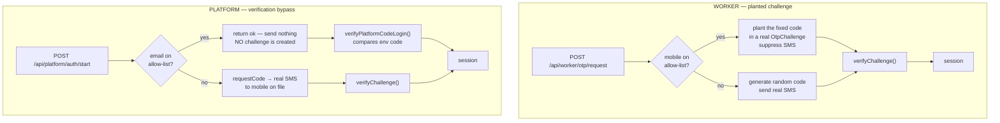

# Authentication overrides — production cutover plan

How SiteComply's three development/test authentication overrides work, who depends on
them, what happens when they are switched off, and the exact steps to remove them safely
when CSCS Smart Check onboarding is complete and the platform moves into full production
operation.

**Status: overrides remain ENABLED by decision.** They are in active use while SiteComply
is under test. Nothing in this document has been executed. Verified against the live App
Service on 26 August 2026.

---

## 1. Exact App Service settings

Resource: `sitecomply-web` · Resource group: `rgSiteComply`

| Setting | Value | Mechanism |
|---|---|---|
| `PLATFORM_DEV_LOGIN_ENABLED` | `1` | Platform — personal |
| `PLATFORM_DEV_LOGIN_EMAIL` | `jc@parryst.com` | Platform — personal |
| `PLATFORM_DEV_LOGIN_CODE` | `231001` | Platform — personal |
| `PLATFORM_TEST_LOGIN_ENABLED` | `1` | Platform — test allow-list |
| `PLATFORM_TEST_LOGIN_EMAILS` | `dtest@`, `pmtest@`, `smtest@`, `ctest@`, `atest@` `sitecomply.co.uk` | Platform — test allow-list |
| `PLATFORM_TEST_LOGIN_CODE` | `123456` | Platform — test allow-list |
| `WORKER_TEST_LOGIN_ENABLED` | `1` | Worker |
| `WORKER_TEST_LOGIN_MOBILES` | `+447700900150` | Worker |
| `WORKER_TEST_LOGIN_CODE` | `231001` | Worker |

Related, not an override but part of the same cutover:

| Setting | Value | Note |
|---|---|---|
| `SMS_PROVIDER` | `mock` | Currently inert — see §6 |

**All three mechanisms are fail-closed.** Each requires its `*_ENABLED` to be exactly
`"1"` *and* a non-empty allow-list *and* a non-empty code. Miss any one and the mechanism
does not exist — the account falls through to the normal flow. There is no global bypass;
an identifier that is not on an enabled allow-list is entirely unaffected.

## 2. Who depends on them

**7 accounts in total.**

| Account | Identifier | Code | Role |
|---|---|---|---|
| Personal dev | `jc@parryst.com` | `231001` | Platform (real account) |
| Director test | `dtest@sitecomply.co.uk` | `123456` | Platform |
| Project Manager test | `pmtest@sitecomply.co.uk` | `123456` | Platform |
| Site Manager test | `smtest@sitecomply.co.uk` | `123456` | Platform |
| Client test | `ctest@sitecomply.co.uk` | `123456` | Platform |
| Auditor test | `atest@sitecomply.co.uk` | `123456` | Platform |
| TEST WORKER | `+447700900150` | `231001` | Worker portal |

Every other user — real Platform users and real workers — already authenticates through
the normal OTP flow today and is **completely unaffected** by any of this.

## 3. The two mechanisms are not the same

This is the single most important fact for planning the cutover. They look symmetrical
and behave very differently.



**Worker — planted challenge.** The override changes *delivery only*. A genuine
`OtpChallenge` row is created with the fixed code and no SMS is sent. Verification is
completely untouched: hashing, TTL, resend cooldown, the hourly cap, the wrong-code
attempt limit and single-use consumption all still apply. The test account exercises the
same code path as a real worker.

**Platform — verification bypass.** The override selects an entirely *different* code
path. `/start` returns early and creates no challenge at all; `/verify` compares the
submitted code against the environment variable via `verifyPlatformCodeLogin`. The two
branches are mutually exclusive, keyed off the resolved account's email.

The practical consequence: **switching off the worker override is low risk, because the
real path is already proven by that account. Switching off the Platform overrides moves
six accounts onto a code path they have never used.**

## 4. What happens when each is disabled

### Worker override

The mobile falls through to the normal flow: a random code is generated and a real SMS is
sent to `+447700900150`.

> **`+447700900150` is inside Ofcom's reserved `07700 900xxx` range.** It is not
> allocated to any handset and never will be. A real SMS to it cannot be delivered. This
> was deliberate — the account was moved into that range precisely so it is structurally
> incapable of texting a real person.

So disabling the worker override does not degrade the account, it **ends** it. There is no
"it still works but slower" state. Decide at cutover which you want:

- **Delete the TEST WORKER account** — cleanest, and the assumption of this plan; or
- **Re-point it at a real handset** you control, if you still want a worker test identity
  in production. It then behaves like any other worker and costs real SMS per sign-in.

### Platform overrides

Each of the six accounts switches to the real SMS path in `/start`, which requires a
**mobile number on file**. The branch is explicit:

```
if (!user.mobile) → 400 { reason: 'no_mobile' }
  "This account has no mobile number for SMS sign-in.
   Please contact your administrator."
```

| Account state at cutover | Result |
|---|---|
| Mobile on file, SMS provider working | Signs in normally by SMS OTP |
| **No mobile on file** | **Locked out.** Cannot sign in at all |
| Mobile on file, SMS provider misconfigured | Locked out until the provider is fixed |

`jc@parryst.com` is a **real Platform account**, not a synthetic one. If it has no mobile
on file, disabling `PLATFORM_DEV_LOGIN_ENABLED` locks you out of your own platform. This
is the one genuine risk in the whole cutover and §5 exists to eliminate it.

Note also that the override path bypasses the OTP rate limits entirely. After cutover the
real limits apply to these accounts: **6-digit code, 30-second resend cooldown, maximum 5
requests per hour per mobile.** Six testers sharing one handset would hit that cap.

## 5. Pre-conditions — all must be true before cutover

- [ ] **CSCS Smart Check onboarding is complete** and no longer needs the test accounts.
- [ ] **Every Platform account that is to survive has a valid mobile on file.**
      Check in Admin Centre → Platform Users for all six, `jc@parryst.com` first.
      This is the lockout-prevention step and is not optional.
- [ ] **A real Platform user has successfully signed in by SMS OTP** — i.e. a
      non-override account has completed `/start` → SMS → `/verify` in production. This
      proves the real path end to end before you depend on it.
- [ ] **The SMS provider is confirmed working.** `resolveSmsProvider()` reads the
      `SmsConfig` row from Admin → Settings → Integrations first and only falls back to
      the `SMS_PROVIDER` env var when no row exists. Confirm an active row exists and
      that it is **not** the mock.
- [ ] **A decision is recorded for the five `@sitecomply.co.uk` test accounts** — delete
      them, or give them real mobiles and keep them as staffed accounts. Leaving them
      ACTIVE with no mobile creates six unusable accounts in the users list.
- [ ] **A decision is recorded for TEST WORKER** — delete, or re-point to a real handset.
- [ ] **A maintenance window is agreed.** App-setting changes restart the container;
      allow 3–4 minutes during which sign-in is unavailable.

## 6. `SMS_PROVIDER=mock` — remove it in the same pass

Currently inert, because the `SmsConfig` database row takes precedence. But the fallback
logic is:

```
env SMS_PROVIDER  ??  (NODE_ENV === 'production' ? 'acs' : 'mock')
```

If the `SmsConfig` row is ever deleted or deactivated, the presence of this variable makes
production fall back to the **mock provider** — OTPs stop being delivered, silently, with
no error. If the variable were simply absent, the same situation would correctly fall back
to `acs`.

**The setting is strictly worse than not having it.** Delete it rather than changing its
value.

## 7. Cutover procedure

All commands run from Azure Cloud Shell or an authenticated `az` session.

### Step 1 — Record the current state for rollback

```bash
az webapp config appsettings list -g rgSiteComply -n sitecomply-web \
  --query "[?contains(name,'TEST_LOGIN') || contains(name,'DEV_LOGIN') || contains(name,'SMS_PROVIDER')]" \
  -o json > override-settings-backup.json
```

Keep this file until the cutover is confirmed good. It contains the codes — do not commit
it.

### Step 2 — Confirm the pre-conditions of §5

Do not proceed with any box unticked. The mobile-on-file check is the one that prevents a
lockout.

### Step 3 — Remove all ten settings in a single operation

One call means **one restart**, not three.

```bash
az webapp config appsettings delete -g rgSiteComply -n sitecomply-web --setting-names \
  PLATFORM_DEV_LOGIN_ENABLED \
  PLATFORM_DEV_LOGIN_EMAIL \
  PLATFORM_DEV_LOGIN_CODE \
  PLATFORM_TEST_LOGIN_ENABLED \
  PLATFORM_TEST_LOGIN_EMAILS \
  PLATFORM_TEST_LOGIN_CODE \
  WORKER_TEST_LOGIN_ENABLED \
  WORKER_TEST_LOGIN_MOBILES \
  WORKER_TEST_LOGIN_CODE \
  SMS_PROVIDER
```

> Unsetting the three `*_ENABLED` variables alone is sufficient to disable every
> mechanism — each checks `=== '1'` before reading anything else. The remaining variables
> are removed so that no fixed code is left sitting in the App Service configuration.

### Step 4 — Wait for the restart to complete

**Do not use `/api/health` as the signal.** It returns 200 from the *old* container while
the new one starts. Wait 3–4 minutes, then confirm the new container is actually serving:

```bash
sleep 240
curl -s https://sitecomply-web.azurewebsites.net/api/health
az webapp config appsettings list -g rgSiteComply -n sitecomply-web \
  --query "[?contains(name,'TEST_LOGIN') || contains(name,'DEV_LOGIN') || contains(name,'SMS_PROVIDER')]" -o tsv
```

The second command must return **nothing**.

### Step 5 — Verify the overrides are dead

- [ ] Sign in as `jc@parryst.com`. Expect an **SMS to the mobile on file**, not the
      `231001` prompt working. Entering `231001` must now fail.
- [ ] Attempt `dtest@sitecomply.co.uk` with `123456`. Must fail.
- [ ] Attempt TEST WORKER `+447700900150` with `231001`. Must fail.
- [ ] Confirm no new `[DEV-AUTH-OVERRIDE]` lines appear in the log stream:

```bash
az webapp log tail -g rgSiteComply -n sitecomply-web | grep 'DEV-AUTH-OVERRIDE'
```

Both mechanisms emit under that one tag, so a single query covers all three.

### Step 6 — Verify normal authentication is healthy

- [ ] A real Platform user signs in by SMS OTP end to end.
- [ ] A real worker signs in by SMS OTP end to end.
- [ ] Wrong-code, expiry and resend-cooldown behaviour all still correct.

### Step 7 — Tidy the accounts

- [ ] Delete or re-point the five `@sitecomply.co.uk` test accounts per §5.
- [ ] Delete or re-point TEST WORKER per §5.

## 8. Rollback

Immediate and total — re-apply the settings from the Step 1 backup:

```bash
az webapp config appsettings set -g rgSiteComply -n sitecomply-web --settings \
  PLATFORM_DEV_LOGIN_ENABLED=1 \
  PLATFORM_DEV_LOGIN_EMAIL=jc@parryst.com \
  PLATFORM_DEV_LOGIN_CODE=231001 \
  PLATFORM_TEST_LOGIN_ENABLED=1 \
  PLATFORM_TEST_LOGIN_EMAILS=dtest@sitecomply.co.uk,pmtest@sitecomply.co.uk,smtest@sitecomply.co.uk,ctest@sitecomply.co.uk,atest@sitecomply.co.uk \
  PLATFORM_TEST_LOGIN_CODE=123456 \
  WORKER_TEST_LOGIN_ENABLED=1 \
  WORKER_TEST_LOGIN_MOBILES=+447700900150 \
  WORKER_TEST_LOGIN_CODE=231001
```

Do **not** restore `SMS_PROVIDER=mock` — it was never doing anything useful (§6).

No deploy, no code change and no database change is involved in either direction. The
whole cutover is reversible in about four minutes.

## 9. Permanent removal from the code — later, optional

Only once the cutover has been stable for a while and there is no intention of
reinstating a test identity. Until then the mechanisms cost nothing while disabled.

| Remove | Then |
|---|---|
| `services/auth/platformDevOverride.ts` | Delete the `isPlatformOverrideAccount` branch in `/api/platform/auth/start` and both branches in `/api/platform/auth/verify` |
| `services/auth/workerTestLogin.ts` | Delete the single `isWorkerTestAccount` branch in `otpService.requestCode` |

Also worth revisiting at that point: `lib/config.ts` still exports an unused `isDev`
helper based on `NODE_ENV !== 'production'`. That shape **fails open** — an unset,
misspelt or renamed `NODE_ENV` reads as development. It is unused today; it should not be
allowed to become the basis of a future gate. See tag
`archive/otp-disclosure-hardening` for the fuller argument.

## 10. Summary of risk

| Risk | Severity | Mitigation |
|---|---|---|
| `jc@parryst.com` has no mobile on file → total lockout | **High** | §5 pre-condition check; §8 rollback in ~4 min |
| SMS provider not actually working | **High** | §5 requires a proven real sign-in first |
| Test accounts left ACTIVE but unusable | Medium | §7 Step 7 |
| `SmsConfig` row later removed while `SMS_PROVIDER=mock` set | Medium | §6 — delete the variable |
| Rate limits surprise testers post-cutover | Low | 5/hour per mobile; use separate handsets |

The design decisions that make this safe were made when the overrides were built: they are
env-gated rather than code-gated, so cutover needs no deploy; they are fail-closed, so
removing one variable is enough; and they are scoped to named accounts, so nothing else in
the platform can be affected by turning them off.
